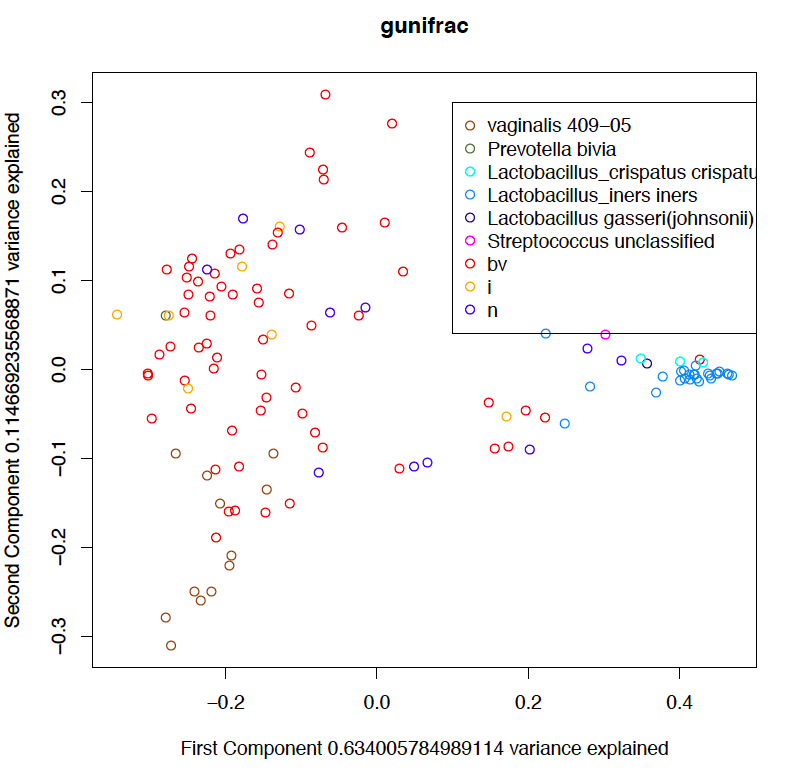
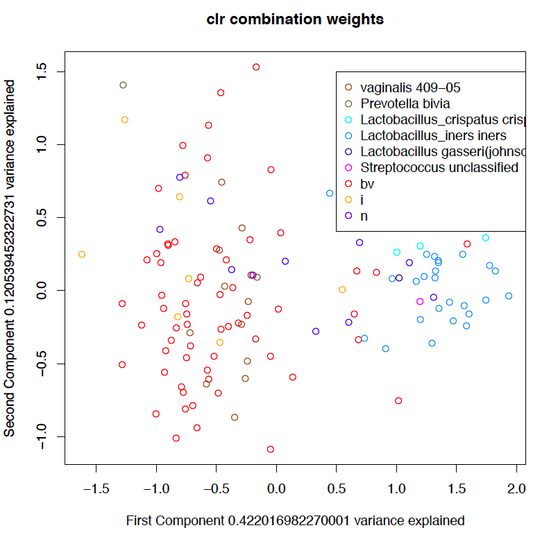
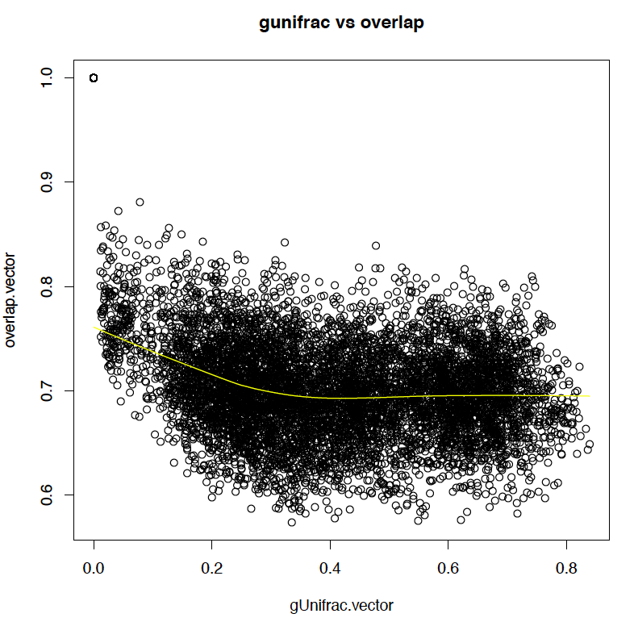
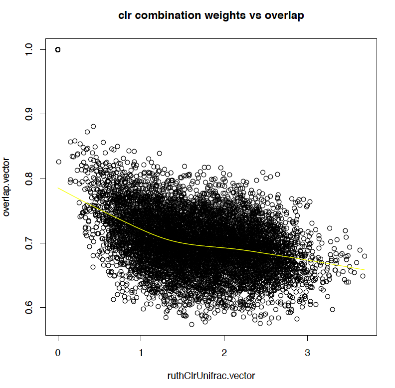

CLRUniFrac
==========

Calculate (UniFrac difference)[http://www.mothur.org/wiki/Weighted_UniFrac_algorithm] by weighting by centered log ratio transformed abundances, rather than proportional abundance. Preserves the distance property of UniFrac, while allowing for weighting.

##CLR weighting method for UniFrac

####CLR
The centered log ratio (CLR) transform is sort of an alternative for rarefaction, used to allow comparison between samples even if the total number of reads per sample is different. To perform the transform, first, all the OTUs with no counts across all samples are removed. Then, because a zero doesn't necessarily mean that the OTU is absent in that sample, a prior of 0.5 is added to all zeros, representing a 50% chance of presence. Lastly, the values are logged (here we have used log base 2), and subtracted by the mean of all the logged values in the same sample (the arithmetic mean in log space the same as the geometric mean in normal space).

####UniFrac
Unweighted UniFrac distance is calculated using a phylogenetic tree, accounting for which species are present in each sample, and how far apart they are in the tree. Clasically weighted UniFrac is weighted by the proportion of abundance of the species under each node in the tree.

####CLR weighting
CLR weighted UniFrac is weighted by the CLR value at each node of the phylogenetic tree, if all the read counts from all the OTUs under the node are treated as if they come from one OTU. The formula for combining two CLR values into one combined CLR value, given the previous geometric mean and the previous number of items in the group is:
```
new CLR = log (old CLR 1 + old CLR 2) - new mean
= log(2^(old CLR 1 + old mean) + 2^(old CLR 1 + old mean)) -
(old mean * previous number of items - old CLR 1 - old CLR 2
	+ log(2^(old CLR 1 + old mean) + 2^(old CLR 1 + old mean)))/new number of items
= log(2^(old CLR 1 + old mean) + 2^(old CLR 1 + old mean)) -
(old mean * previous number of items - old CLR 1 - old CLR 2
	+ log(2^(old CLR 1 + old mean) + 2^(old CLR 1 + old mean)))/
(previous number of items - 1)
```
and the code for that is

```
oldMean <- geometricMean[node.loc, cum[node.loc, ]!=0 & otu.tab[, i]!=0]
numSamples <- effectiveNumSamples[node.loc, cum[node.loc, ]!=0 & otu.tab[, i]!=0]
x <- cum[node.loc, cum[node.loc, ]!=0 & otu.tab[, i]!=0]
y <- otu.tab[cum[node.loc, ]!=0 & otu.tab[, i]!=0, i]
newMean <- ( (oldMean*numSamples) - log2(x) - log2(y) + log2(x+y) )/numSamples-1
geometricMean[node.loc, cum[node.loc, ]!=0 & otu.tab[, i]!=0] <- newMean
geometricMean[node.loc,  geometricMean[node.loc,]==0]<- otu.tab.mean[geometricMean[node.loc,]==0]
cum[node.loc, ] <- cum[node.loc, ] + otu.tab[, i]
effectiveNumSamples[node.loc, otu.tab[, i]!=0] <- effectiveNumSamples[node.loc, otu.tab[, i]!=0] - 1
clrcum[node.loc,cum[node.loc, ]!=0 & otu.tab[, i]!=0] <- log2(cum[node.loc, cum[node.loc, ]!=0 & otu.tab[, i]!=0]) - geometricMean[node.loc,cum[node.loc, ]!=0 & otu.tab[, i]!=0]
```

##CLR weighting vs. proportional abundance weighting

####Better separation?

My very preliminary tests show that the CLR weighting may allow more subtle differences to be separated better. For example, in this proportional abundance weighting of a set of vaginal microbiome samples, samples diagnosed with bacterial vaginosis (BV) and normal samples separate very well.

In the CLR weighted version, not only does BV separate from normal, but you can also see a good separation between the Lactobacillus Crispatus and the Lactobacillus Iners dominated normal samples


####Better correlation with overlap?

I've also caculated overlap by adding something to all CLR values to make them positive, and making pairwise comparisions where I summed the minimum CLR value per OTU and divided it by the maximum value for each OTU, producing an overlap metric between 0 and 1. By plotting these values with the UniFrac distance produced, it appears that CLR weighting may correlate better with overlap, as visualized by the lowess line of best fit in yellow.



Furthermore, 

##Files

####Files in main folder

#####[CLRUniFrac.r](CLRUniFrac.r)
Generalized UniFrac script with weighting replaced by a centered log ratio transformed values based weighting (details below). Variance adjusted UniFrac feature is removed.

#####[GUniFrac.r](GUniFrac.r)
Generalized UniFrac script ripped straight from the [GUniFrac R package][1]


####Files in [test_script](clr_vs_proportion_unifrac/brazil_study_test) folder

#####[pcoa_test_script.r](clr_vs_proportion_unifrac/brazil_study_test/pcoa_test_script.r)
Test script that runs GUniFrac and CLRUniFrac on sample data.

#####[metrics.r](clr_vs_proportion_unifrac/brazil_study_test/metrics.r)
Script that calculates overlap and average read count between all pairs of samples.

#####[test_plots_with_brazil_study_data.pdf](clr_vs_proportion_unifrac/brazil_study_test/test_plots_with_brazil_study_data.pdf)
Plots that compare proportional abundance weighted GUniFrac, CLRUnifrac, and QIIME output. Plots are:
* overlap between samples vs. CLRUniFrac distances between samples
* overlap between samples vs. GUniFrac distances between samples
* average total read count between samples vs. CLRUniFrac distances between samples
* average total read count between samples vs. GUniFrac distances between samples
* Principle Coordinates of Analysis plot of CLRUniFrac distances
	* Colored by Bacterial Vaginosis (as diagnosed by Nugent and Amsel), Intermediate, and Normal. Samples which are composed of at least 50% of the same taxa are colored by that taxa.
* Principle Coordinates of Analysis plot of GUniFrac distances
	* Colored by Bacterial Vaginosis (as diagnosed by Nugent and Amsel), Intermediate, and Normal. Samples which are composed of at least 50% of the same taxa are colored by that taxa.
* Principle Coordinates of Analysis plot of weighted UniFrac distances calculated by QIIME
* Principle Coordinates of Analysis plot from QIIME output

####Files in [brazil_study_data](clr_vs_proportion_unifrac/brazil_study_test/brazil_study_data) folder
This study collected 16S rRNA sequencing data from vaginal swabs of women in Brazil.

#####[fasttree_all_seed_OTUs.tre](clr_vs_proportion_unifrac/brazil_study_test/brazil_study_data/fasttree_all_seed_OTUs.tre)
Phylogenetic tree of taxa, based on a sequence alignment.

#####[metadata_BVsamplesonly.txt](clr_vs_proportion_unifrac/brazil_study_test/brazil_study_data/metadata_BVsamplesonly.txt)
Metadata file.

#####[td_OTU_tag_mapped_RDPlineage_blastcorrected_vvcfilter_tempgenera.txt](clr_vs_proportion_unifrac/brazil_study_test/brazil_study_data/td_OTU_tag_mapped_RDPlineage_blastcorrected_vvcfilter_tempgenera.txt)
Counts per sample per operational taxonomic unit.

#####[weighted_unifrac_dm_from_qiime.txt](clr_vs_proportion_unifrac/brazil_study_test/brazil_study_data/weighted_unifrac_dm_from_qiime.txt)
UniFrac distance matrix output by QIIME.

#####[weighted_unifrac_pc_from_qiime.txt](clr_vs_proportion_unifrac/brazil_study_test/brazil_study_data/weighted_unifrac_pc_from_qiime.txt)
Principle Coordinates of Analysis vectors output by QIIME.

[1]: http://cran.r-project.org/web/packages/GUniFrac/index.html